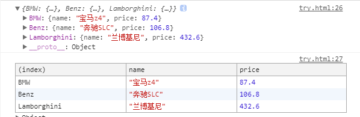
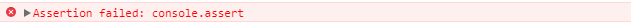
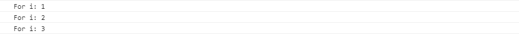
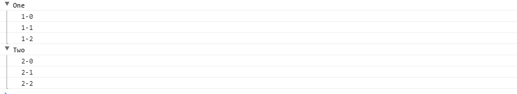
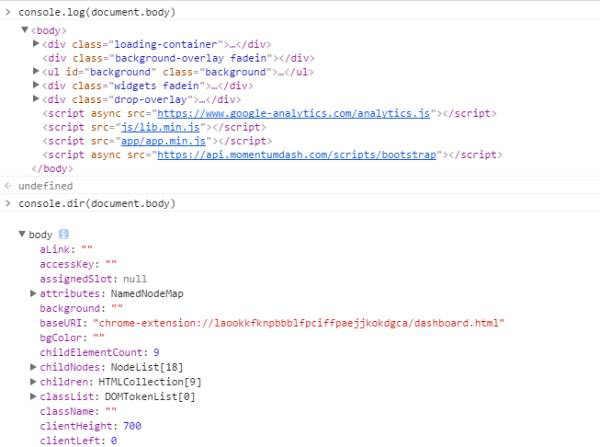

## JS错误类型（6种）
* __SyntaxError__: 语法错误。
* __ReferenceError__: 引用错误，未找到引用的对象、函数、变量等。
* __RangeError__: 范围错误，专指参数超出范围。
* __TypeError__: 类型错误，错误的调用了对象的方法。
* __EvalError__: eval() 方法错误使用。
* __URIError__: URL地址错误。

### window.onerror
    可以通过设置returnValue=true，或直接return true来阻止浏览器显示错误信息。但不会阻止script debuggers弹出的调试框。

```html
<script type="text/javascript">
    window.onerror = function(errorMessage,scriptURI,lineNumber,columnNumber,error) {
         if (error) {
            console.log(error);
         } else {
            console.log(scriptURI + ' - ' + lineNumber + ' - ' + columnNumber + ' - ' + errorMessage);
         }
    }
    alert(err);
</script>
```

## Error 对象
    Error:封装错误信息的对象，在发生错误时，自动创建。
* __try__     检测代码块的错误。
* __catch__   错误处理。
* __throw__   自定义错误。
```html
    <script type="text/javascript">
        throw  new  Error("自定义错误信息！");

        try{
            // 可能出现错误的语句
            throw "抛出自定义错误";
        }catch(err){
            //err: 自动获得错误对象——不可省略
            //一旦出错，才执行的错误处理代码: 提示错误, 记录日志
        }finally{
            //无论是否出错，都必须执行的代码: 释放资源
        }
    </script>
```

> 属性: 
>  
> * __constructor__: 返回创建该对象的构造函数。
> * __err.name__ : 返回错误或异常的类型名称。
> * __err.message__: 错误或异常的提示信息。
> * __prototype__: 返回创建该对象的函数的原型对象。
> 
> 方法：
> 
> * __toString()__: 返回包含相关错误信息的字符串。
> 
> 非标准属性：
> 
> * __fileName__ : 仅FireFox支持发生错误或异常的文件名。
> * __lineNumber__: 仅FireFox支持发生错误或异常的行号。
> * __columnNumber__: 仅FireFox支持发生错误或异常的列号。
> * __number__: 仅IE支持表示与特定错误相关的数字值(相当于错误号)。
> * __stack__: FireFox/Chrome/IE10+支持返回错误或异常的代码跟踪信息。PS:try.html:17:2 --- alert_error is not defined
>

## debugger
    debugger 关键词用于执行停止JavaScript代码的断点。

## Console 对象
### console.log()
```html
<script>
    console.log("Hello", "World");
    // Hello World
    // console.log() 的参数可以有多个，输出的结果以一个空格隔开。
    console.log("%d年%月%日", 2017, 08, 14);
    // 2017年08月14日
    // console.log() 可以使用 C 语言 printf() 风格的占位符，不过其支持的占位符种类较少，只支持字符串（%s）、整数（%d或%i）、浮点数（%f）和对象（%o）
</script>
```
### console.warn()、console.info()、console.error()
方法的使用方法跟 console.log() 一模一样，差别在于输出的颜色与图标不同。下面是示例：
```html
<script type="text/javascript">
    console.log("log");
    console.info("info");
    console.warn("warning");
    console.error("error");
</script>
```

### console.table()
当输出类似于这种两层嵌套的对象时，我们可以选择 console.table() 以表格的形式输出。当然，嵌套三层及以上的也会以表格形式输出，但限于表格只能显示二维信息的特点，其会在嵌套三层或以上的地方会显示 "Object" 字符串。
```html
<script type="text/javascript">
    const car = {
        "BMW" : {"name" : "宝马z4", "price" : 87.4},
        "Benz" : {"name" : "奔驰SLC", "price" : 106.8},
        "Lamborghini" : {"name" : "兰博基尼", "price" : 432.6}
    }
    console.log(car);
    console.table(car);
</script>
```
控制台console.log() 对比 console.table()输出结果： <br>

### console.time()、console.timeEnd()
在调试时，我们经常需要知道一段代码执行时间，用 console.time() 和 console.timeEnd() 包围要测试运行时间的代码，这两个方法的参数保持一致，以便正确识别和匹配代码开始和结束的位置。看下面一段代码：
```html 
<script type="text/javascript">
    console.time("for test")
    var arr = [];
    for(var i=0; i<=100000; i++){
        arr.push({"key":i});
    }
    console.timeEnd("for test");
</script>
```
输出为：for test: 22.484130859375ms
### console.assert()
console.assert() 类似于单元测试中的断言，当表达式为 false 时，输出错误信息。示例如下：
```html
<script type="text/javascript">
    var arr = [1,2,3];
    console.assert(arr.length === 4);
</script>
```

### console.count()
调试代码时，我们经常需要知道一段代码被执行了多少次，我们可以使用 console.count() 来方便的达到我们的目的。示例如下：
```html
<script type="text/javascript">
    for(var i=0; i<=6; i++){
        console.count("For i");
    }
</script>
```

### console.group()、 console.groupEnd() 与 console.groupCollapsed()
一般的 console.log() 方法的输出没有层级关系，在需要一些显示层级关系的输出中显得苍白无力，使用 console.group() 可以达到我们的目的。示例代码如下：
```html
<script type="text/javascript">
    console.group("One");
    console.log("1-0");
    console.log("1-1");
    console.log("1-2");
    console.groupEnd("One");
    console.group("Two");
    console.log("2-0");
    console.log("2-1");
    console.log("2-2");
    console.groupEnd("Two");
</script>
```

把 "group" 换成 "groupCollapsed"，则默认为折叠运行结果。
### console.dir()
console.dir() 为了将特定的 JS 对象显示为可以交互的列表，而列表是折叠起来的。

在 Chrome 中打印 DOM 元素时，两个方法输出的结果大不一样。console.log() 会将 DOM 元素以 HTML 的形式输出，而 console.dir() 则会以 JSON 对象的形式输出。

