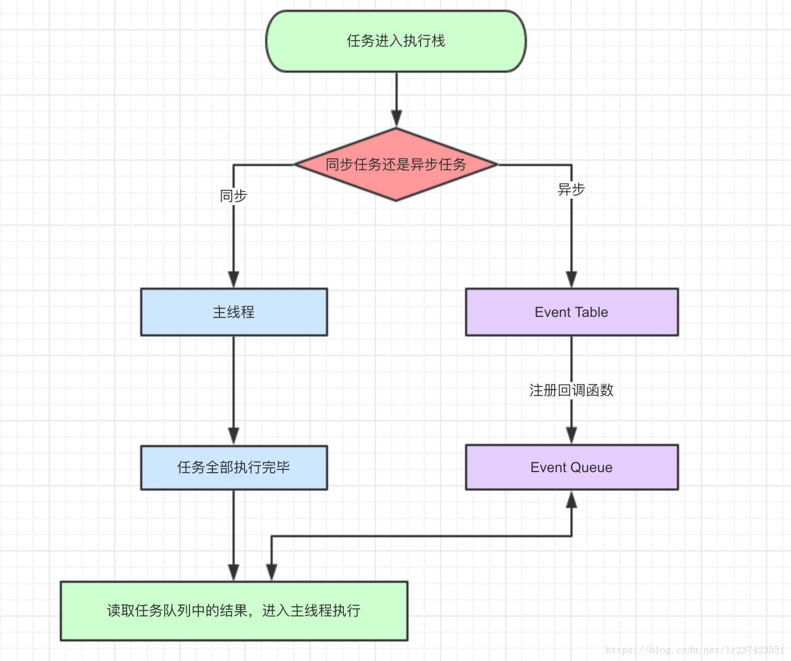
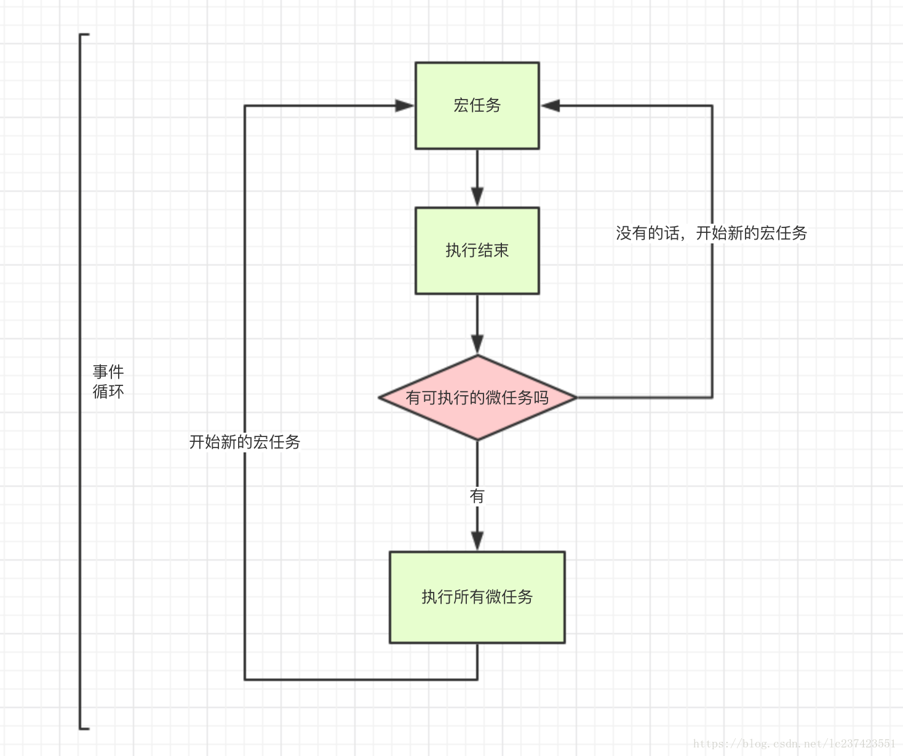

### JavaScript是一门单线程语言
  
  一切JavaScript版的“多线程”都是用单线程模拟出来的，一起JavaScript多线程都是纸老虎。

### 同步任务
  
    指主线程上排队执行的任务，只有前一个任务执行完毕，才能执行后一个任务。
    
### 异步任务

    指不进入主线程，某个异步任务可以执行了，该任务才会进入主线程执行。
    
### javascript事件循环

  * 同步和异步任务分别进入不同的执行“场所”，同步任务进入主线程，异步任务进入`Event Tableb`并注册函数。
  * 当指定的事件完成时，`Event Table`会将这个函数移入`Event Queue`。
  * 主线程内的任务执行完毕为空，去`Event Queue`读取相应的函数，进入主线程执行。
  * 上述过程会不断重复，也就常说的`Event Loop`（事件循环）
  
  js引擎存在`monitroing process`进程，会持续不断的检查主线程执行栈是否为空，一旦为空，就会去`Event Queue`那里检查是否有等待被调用的函数。
  
  
  
### macro-task 宏任务
    
    包括整体代码`script`, `setTimeout`, `setInterval`

### micro-task 微任务
    
    `Promise`, `process.nextTick`
    
### 宏任务Event Queue 和 微任务Event Queue
  
    Js异步有一个机制，就是遇到宏任务，先执行宏任务，降宏任务放入`Event Queue`，然后再执行微任务，将微任务放入`Event Queue`。最骚的是，这两个`Queue`不是一个`Queue`。当你往外拿的时候先从微任务里拿这个回调函数，然后再从宏任务的`Queue`上拿宏任务的回调函数。
    
    
    
    
### 零延迟

    零延迟并不意味着回调会立即执行。以0为第二参数调用`setTimeout`并不表示在0ms后就立即执行回调函数。
    
    延迟参数是运行时处理请求所需的最小等待时间，但并不保证是准确的等待时间。
    
  ##### setTimeout
    
    `setTimeout(fn, 0)` 的含义指某个任务在主线程最早可得的空闲时间执行，意思就是不用再等多少秒了，只要主线程执行栈内的同步任务全部执行完成，栈为空就马上执行。
    
    `setTimeout` 需要等待当前队列中所有的消息都处理完毕之后才能执行，即使已经超出了由第二参数所指定的时间。
  
  ##### setInterval
    
    `setInterva`l会每隔指定的时间将注册的函数置入`Event Queue`，如果前面的任务耗时太久，那么同样需要等待。
    
    一旦`setInterval`的回调函数fn执行时间超过了延迟时间ms，那么就完全看不出来有时间间隔了。
  

### 相关阅读

  [并发模型与事件循环](https://developer.mozilla.org/zh-CN/docs/Web/JavaScript/EventLoop)
  [参考博客](https://juejin.im/post/59e85eebf265da430d571f89)
  

